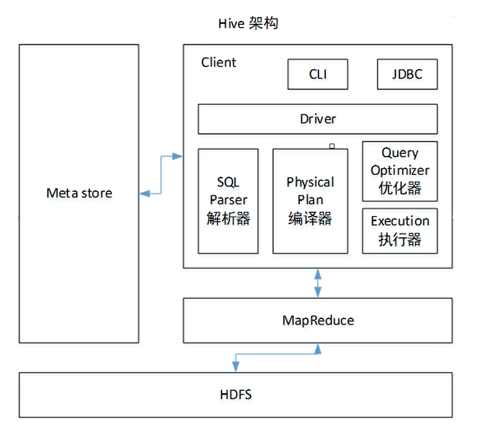

# Hive基础
## 数据仓库客户端, 将SQL翻译成MapReduce程序用于处理分布式存储集群上的数据
## 优缺点
> 优点
>> * 使用类SQL语法
>> * 擅长处理实时性不高的海量数据
>> * 可以自定义函数
>
> 缺点
>> * HQL表达能力有限, 不能做迭代式算法
>> * 不擅长数据挖掘, 基于MapReduce的数量处理流程, 无法实现效率更高的算法
>> * 自动生成的MapReduce作业通常不够智能化
>> * 调优困难, 粒度较粗, 需要在MapReduce程序上进行调优
## 架构

# [Hive安装启动](https://cwiki.apache.org/confluence/display/Hive/GettingStarted)
## 下载地址
> * [Hive](https://dlcdn.apache.org/hive/)
## 解压hive并配置环境变量
```bash
# 环境变量
export HIVE_HOME=
export PATH=${PATH}:%{HIVE_HOME}/bin

# 解压
tar -zxvf <Hive压缩包> -C ${HIVE_HOME}

# 解决日志冲突
mv ${HIVE_HOME}/lib/log4j-slf4j-impl-2.10.0.jar ${HIVE_HOME}/lib/log4j-slf4j-impl-2.10.0.jar.bak

# 跟踪客户端日志
tail -fn0 /tmp/$(id -un)/hive.log
```
## 启动hive
```bash
# 启动客户端, 启动前需要初始化元数据
hive

# 参数配置的优先级
# hive-default.xml < hive-site.xml < 命令行 < 客户端内set(用户代码)

# hive会同通过环境变量获取hadoop配置信息,可以在hive中指定hadoop的配置

# 命令行形式
hive -hiveconf mapred.reduce.tasks=10

# 客户端内set形式
set mapred.reduce.tasks=10

# 客户端内查看配置信息
set mapred.reduce.tasks
```
### 初始化元数据
1. derby(默认)
```bash
## 在同一个目录下只允许一个实例执行,并会在目录下生成metastore_db文件夹
## FAILED: HiveException java.lang.RuntimeException: Unable to instantiate org.apache.hadoop.hive.ql.metadata.SessionHiveMetaStoreClient
cd ${HIVE_HOME} && schematool -dbType derby -initSchema
```
2. MySQL
> [安装](https://www.linuxidc.com/Linux/2019-12/161832.htm)
>> * [下载MySQL5.7](https://mirrors.tuna.tsinghua.edu.cn/mysql/downloads/MySQL-5.7/mysql-5.7.34-el7-x86_64.tar.gz)
>> * [下载libaio](https://mirrors.aliyun.com/centos/7.9.2009/os/x86_64/Packages/libaio-0.3.109-13.el7.x86_64.rpm)
>> * [MySQL驱动(Java)](https://mirrors.tuna.tsinghua.edu.cn/mysql/downloads/Connector-J/)
>> 安装完成之后使用`schematool -dbType mysql -initSchema -verbose`初始化元数据库
>
> MySQL授权登录(not allowed to connect to this MySQL server)
>> 让root用户从任何主机使用密码登录到mysql服务器
>>> GRANT ALL PRIVILEGES ON *.* TO 'root'@'%' IDENTIFIED BY 'password' WITH GRANT OPTION;
>>
>> 让root用户从192.168.100.100使用密码登录到mysql服务器
>>> GRANT ALL PRIVILEGES ON *.* TO 'root'@'192.168.100.100' IDENTIFIED BY 'password' WITH GRANT OPTION;
>>
>> 让root用户从192.168.100.100使用密码登录到mysql服务器的metastore数据库
>>> GRANT ALL PRIVILEGES ON metastore.* TO 'root'@'192.168.100.100' IDENTIFIED BY 'password' WITH GRANT OPTION;
>>
>> 最后都需要`FLUSH PRIVILEGES;`更新权限

```bash
#!/bin/bash

# MySQL安装包位置
MYSQL_SRC='./mysql-5.7.34-el7-x86_64.tar.gz'

# MySQL安装目录
MYSQL_WORKSPACE='/usr/local/mysql'
# MySQL数据保存目录
MYSQL_DATA_DIR='/usr/local/mysql/data'
# MySQL日志目录
MYSQL_LOG_DIR='/usr/local/mysql/log'
# MySQL日志文件名
MYSQL_LOG_FILE='mysql.log'

# 用户组
MYSQL_USER='mysql'
MYSQL_GOURP='mysql'

# 包下载地址
MYSQL_URL='https://mirrors.tuna.tsinghua.edu.cn/mysql/downloads/MySQL-5.7/mysql-5.7.34-el7-x86_64.tar.gz'
LIBAIO_URL='https://mirrors.aliyun.com/centos/7.9.2009/os/x86_64/Packages/libaio-0.3.109-13.el7.x86_64.rpm'
DRIVER_URL='https://mirrors.tuna.tsinghua.edu.cn/mysql/downloads/Connector-J/mysql-connector-java-5.1.49.tar.gz'

# 卸载自带mariadb
echo "Uninstall mariadb"
rpm -e --nodeps mariadb-libs >& /dev/null

# 下载驱动
echo "download MySQL Driver"
curl -L "${DRIVER_URL}" -o "/tmp/$(basename ${DRIVER_URL})"
cd ${HIVE_HOME}/lib && tar -zxf "/tmp/$(basename ${DRIVER_URL})" "$(tar tf /tmp/$(basename ${DRIVER_URL})  | grep jar | sort | tail -1)" --strip-components=1 -C .
chown --reference=${HIVE_HOME}/lib ${HIVE_HOME}/lib/*

# 检查MySQL安装包位置, 如不存在则下载
if [[ ! -f "${MYSQL_SRC}" ]];then
    echo "can not found MySQL Installation package: []"
    echo "Starting to download MySQL installation package"
    curl -L "${MYSQL_URL}" -o "/tmp/$(basename ${MYSQL_URL})"
    MYSQL_SRC="/tmp/$(basename ${MYSQL_URL})"
    echo "Download complete! file path: /tmp/$(basename ${MYSQL_URL})"
fi

# 检查安装目录是否已经存在
if [[ -d "${MYSQL_WORKSPACE}" ]];then
    echo "The installation directory already exists: ${MYSQL_WORKSPACE}"
    exit 1
fi

if [[ -d "${MYSQL_DATA_DIR}" ]];then
    echo "The data directory already exists: ${MYSQL_DATA_DIR}"
    exit 1
fi

echo "Start creating directories and log files"
# 创建目录
mkdir -p  "${MYSQL_WORKSPACE}" "${MYSQL_DATA_DIR}" "${MYSQL_LOG_DIR}"
# 创建日志文件
touch "${MYSQL_LOG_DIR}/${MYSQL_LOG_FILE}"


# 开始解压文件
echo "Start extracting files"
tar -zxf "${MYSQL_SRC}" --strip-components=1 -C "${MYSQL_WORKSPACE}"
if [[ $? != 0 ]];then
    echo "Failed to unzip the file"
    exit 1
fi

# 检查MySQL依赖是否安装, 如未安装则下载
echo "Start checking whether libaio exists"
(yum list installed libaio || rpm -qa | grep libaio) >& /dev/null
if [[ $? != 0 ]];then
    echo "Attempting to install libaio using Yum"
    yum install -y libaio >& /dev/null
    if [[ $? != 0 ]];then
        echo "Failed to install using yum. Start downloading libaio installation package"
        curl -L LIBAIO_URL -o "/tmp/$(basename ${LIBAIO_URL})"
        echo "Download complete! file path: /tmp/$(basename ${LIBAIO_URL})"
        echo "Start installing libaio"
        rpm -i "/tmp/$(basename ${LIBAIO_URL})"
        if [[ $? != 0 ]];then
            echo "Installation failed"
            echo "Exit installation!"
            exit 1
        else
            echo "Installation succeeded"
        fi
    fi
fi

# 创建用户组
echo "Start creating user groups and users"
groupadd "${MYSQL_GOURP}" >& /dev/null
if [[ $? != 0 ]];then
    echo "The ${MYSQL_GOURP} user group exists, it will be reused"
fi
useradd -g "${MYSQL_GOURP}" "${MYSQL_USER}" >& /dev/null
if [[ $? != 0 ]];then
    echo "The ${MYSQL_USER} user exists, it will be reused"
fi

# 修改文件权限
chown -R "${MYSQL_USER}:${MYSQL_GOURP}" "${MYSQL_WORKSPACE}" "${MYSQL_DATA_DIR}" "${MYSQL_LOG_DIR}" "${MYSQL_LOG_DIR}/${MYSQL_LOG_FILE}"
chmod -R 755 "${MYSQL_WORKSPACE}" "${MYSQL_DATA_DIR}" "${MYSQL_LOG_DIR}" "${MYSQL_LOG_DIR}/${MYSQL_LOG_FILE}"

# 生成配置文件
echo "Generate basic configuration file"
if [[ -f /etc/my.cnf ]];then
    echo "The existing configuration file was found and renamed /etc/my.cnf.bak"
    cp -p /etc/my.cnf /etc/my.cnf.bak
fi
cat > /etc/my.cnf << EOF
[client]    
port=3306
socket=/tmp/mysql.sock

[mysqld]
user=mysql
port=3306
socket=/tmp/mysql.sock
basedir=${MYSQL_WORKSPACE}
datadir=${MYSQL_DATA_DIR}
pid-file=${MYSQL_DATA_DIR}/mysql.pid
character-set-server=utf8
symbolic-links=0
EOF

# 初始化MySQL
if [[ $(find "${MYSQL_DATA_DIR}" -type f | wc -l) != 0 ]];then
    echo "There are files in the data folder before initialization, unable to initialize"
    exit 1
fi
echo "Start initializing MySQL"
${MYSQL_WORKSPACE}/bin/mysqld --user=mysql --basedir=${MYSQL_WORKSPACE} --datadir=${MYSQL_DATA_DIR} --initialize

# 设置开机启动并启动MySQL
echo "Set startup and start MySQL"
cp "${MYSQL_WORKSPACE}/support-files/mysql.server" "/etc/init.d/mysql"
chkconfig mysql on
service mysql start

echo "installation is complete!"
echo "Please use the command to log in to MySQL and enter the initial password: ${MYSQL_WORKSPACE}/bin/mysql -uroot -p"
echo "Update your password: alter user user() identified by 'yourpassword';"
```
## 配置
hive-site.xml
```xml
<?xml version="1.0" encoding="UTF-8" standalone="no"?>
<?xml-stylesheet type="text/xsl" href="configuration.xsl"?>
<configuration>
  <property>
    <name>javax.jdo.option.ConnectionURL</name>
    <value>jdbc:mysql://hd01:3306/metastore?useSSL=false</value>
    <description>
      元数据库连接的URL
      需要创建元数据库,数据库名一致
      create database metastore;
    </description>
  </property>
  <property>
    <name>javax.jdo.option.ConnectionDriverName</name>
    <value>com.mysql.jdbc.Driver</value>
    <description>元数据库连接的Driver</description>
  </property>
  <property>
    <name>javax.jdo.option.ConnectionUserName</name>
    <value>root</value>
    <description>元数据库用户名</description>
  </property>
  <property>
    <name>javax.jdo.option.ConnectionPassword</name>
    <value>000000</value>
    <description>元数据库密码</description>
  </property>
  <property>
    <name>hive.metastore.schema.verification</name>
    <value>false</value>
    <description>元数据存储版本验证</description>
  </property>
  <property>
    <name>hive.metastore.event.db.notification.api.auth</name>
    <value>false</value>
    <description>元数据存储授权</description>
  </property>
  <property>
    <name>hive.metastore.warehouse.dir</name>
    <value>/user/hive/warehouse</value>
    <description>默认HDFS的存储目录</description>
  </property>
  <property>
    <name>hive.cli.print.current.db</name>
    <value>true</value>
    <description>客户端打印输出库</description>
  </property>
  <property>
    <name>hive.cli.print.header</name>
    <value>true</value>
    <description>客户端打印输出表头</description>
  </property>
</configuration>
```
## 使用元数据服务的方式访问Hive
hive-site.xml
```xml
<property>
  <name>hive.metastore.uris</name>
  <value>thrift://hd01:9083</value>
  <description>
    指定存储元数据要连接的地址
    hive --service metastore  
  </description>
</property>
```
## 使用JDBC方式访问Hive(需要元数据服务)
hive-site.xml
```xml
<property>
  <name>hive.server2.thrift.bind.host</name>
  <value>hd01</value>
  <description>hiveserver2连接主机</description>
</property>
<property>
  <name>hive.server2.thrift.port</name>
  <value>10000</value>
  <description>hiveserver2连接端口</description>
</property>
```
# 数据类型
## 基本类型(支持类型隐式类型提升,整型,单浮点及<b>符合格式的字符串</b>也可以隐式转化为双浮点)
Hive类型   |Java类型|长度           |示例
:-        |:-       |:-            |:-
TINYINT   |byte     |1byte有符号整数|90
SMALINT   |short    |2byte有符号整数|90
INT       |int      |4byte有符号整数|90
BIGINT    |long     |8byte有符号整数|90
BOOLEAN   |boolean  |true/false    |TRUE
FLOAT     |float    |单精度浮点     |3.14
DOUBLE    |double   |双精度浮点     |3.14
STRING    |String   |字符           |"hello"
TIMESTAMP |-        |时间类型       |-
BINARY    |-        |字节数组       |-
## 集合类型(可以嵌套)
类型    |描述                                      |语法
:-      |:-                                       |:-
STRUCT  |和C的struct类似,相当于java中的bean对象     |struct(),struct<street:string,city:string>
MAP     |kv对,可以用['last']这个key获取最后一个元素  |map(),map<string,int>
ARRAY   |数组,索引从0开始                           |Array(),array<string>
### 定义集合类型时的方式
```sql
-- tom,cary_lily,mary:12_tony:13,waitan_shanghai
-- mark,susu,lucy:11,chaoyang_beijing
create table test(
  name string,
  friends array<string>,
  children map<stringm int>,
  address struct<street:string, city:string>
)
row format delimited
fields terminated by ','
collection items terminated by '_'  -- 由于map和array用的分隔符需要统一,所以数据进入时需要进行数据清晰
map keys terminated by ':'
lines terminated by '\n';
```

# DDL
## 库相关操作
```sql
-- 创建库
create database [if not exists] <databaseName>
[comment 数据库描述]
[location 数据库路径] -- 路径需要加引号
[with dbproperties 描述属性]

-- 显示数据库
show databases;
show databases like 'db_*'; -- 显示'db_'开头的数据库

-- 显示数据库的描述信息
desc database <databaseName>
desc database extended <databaseName> -- 显示描述信息等额外信息

-- 修改数据库描述属性
alter database <databaseName> set dbproperties("createTime"="yyyy-MM-dd")

-- 删除数据库
drop database <databaseName>; -- 删除空数据库
drop database <databaseName> cascade; -- 强制删除非空数据库
```
## 表相关操作
```sql
-- 创建表
create [external] table [if not exists] <tableName> -- external: 外部表
[(colName dataType [comment colComment], ...)] -- 列名, 数据类型, 列注释
[comment tableComment] -- 表注释
[partitioned by (colName dataType [comment colComment], ...)] -- 分区表
[clustered by (colName dataType [comment colComment], ...)] -- 分桶表
[sorted by (colName [asc|desc], ...)] into numBuckets buckets -- 分桶表参数
[row format rowFormat] -- 定义行格式, 文件以逗号分隔字段示例示例: row format delimited fields terminated by ',';
[stored as fileFormat] -- 文件格式
[location hdfsPath] -- 指定表存储位置(一般会把此类表设置为外部表)
[tableproperties (key=value, ...)] -- 表额外属性
[as selectStatement] -- 查询方式建表(参考别的表形式来建表)

-- 删除表
drop table <tableName>;

-- 查看表属性
desc formatted <tableName>;

-- 修改表
-- 修改表为外部表,管理表则改为FALSE
alter table <tableName> set tblproperties('EXTERNAL'='TRUE'); -- 属性大小写敏感
-- 重命名表
alter table <tableName> rename to <newTableName>;
-- 修改列
alter table <tableName> change <oldCol> <newCol> <newType>;
-- 增加列
alter table <tableName> add (<col> <type>, ...)
-- 替换(所有)列
alter table <tableName> replace columns (<col> <type>, ...)

```
### 管理表和外部表
* 通过`external`关键字创建的表为外部表
* 管理表在删除表的时候`会删除元数据同步删除真实数据`
* 外部表在删除表的时候`只会删除元数据,不会删除真实数据`
# DML
## 数据导入
```sql
-- 加载数据
load data [local] inpath '<dataPath>' [overwrite] into table <tableName> [partition (partcol1=val1, ...)]
-- local: 是否从系统本地加载, 没有该参数时,会将HDFS目录上的指定文件剪切到表目录
-- inpath: 路径可以是全路径也可以是相对路径, 相对路径是以进入客户端的路径为基准
-- overwrite: 是否覆盖数据, 否则添加文件
-- partition: 上传到指定分区


-- 插入数据
insert into table <tableName> values (<data>),(<data>)...;

-- 根据表数据查询插入
insert overwrite table <tableName> <sqlSelect>
-- insert into: 追加方式插入到表或分区
-- insert overwrite: 覆盖已存在数据

-- 多表查询插入
from <tableName>
insert into table <tableName>
select ...
insert into table <tableName>
select ...
...;
```
## 数据导出
```sql
-- insert导出
insert overwrite [local] directory <localPath> -- local: 使用则导出到系统本地,否则导出到HDFS路径
row format delimited fields terminated by <separator> -- 如果不指定分隔符将会使用系统自带分隔符
<select ...>;

-- export导出到HDFS(配合import在两个hadoop集群间迁移)
export table <tableName> to <path>
```
```bash
# hadoop命令导出到本地
dfs -get <path>

# hive命令导出
hive -e '<select ...>' > <path>
```
## 数据清空
```sql
truncate table <tableName>; -- 内部表有效
```

## 查询
```sql
select [all|distinct] <>
from <tableName>
[where <condition>]
[group by <colList>]
[order by <colList>]
[cluster by <colList> | [disteribute by <colList>] [sort by <colList>]]
[limit <num>]
```
### 算数运算符
运算符|描述
:-    |:-
A+B  |加
A-B  |减
A*B  |乘
A/B  |除
A%B  |取模
A&B  |按位取与
A|B  |按位取或
A^B  |按位异或
~A   |取反
### 常用函数
```sql
count()
max()
min()
sum()
avg()
nvl(a,b): 当a为null,则输出b值

```
> 常用日期函数
```sql
unix_timestamp:返回当前或指定时间的时间戳	
select unix_timestamp();
select unix_timestamp("2020-10-28",'yyyy-MM-dd');

from_unixtime：将时间戳转为日期格式
select from_unixtime(1603843200);

current_date：当前日期
select current_date;

current_timestamp：当前的日期加时间
select current_timestamp;

to_date：抽取日期部分
select to_date('2020-10-28 12:12:12');

year：获取年
select year('2020-10-28 12:12:12');

month：获取月
select month('2020-10-28 12:12:12');

day：获取日
select day('2020-10-28 12:12:12');

hour：获取时
select hour('2020-10-28 12:12:12');

minute：获取分
select minute('2020-10-28 12:12:12');

second：获取秒
select second('2020-10-28 12:12:12');

weekofyear：当前时间是一年中的第几周
select weekofyear('2020-10-28 12:12:12');

dayofmonth：当前时间是一个月中的第几天
select dayofmonth('2020-10-28 12:12:12');

months_between： 两个日期间的月份
select months_between('2020-04-01','2020-10-28');

add_months：日期加减月
select add_months('2020-10-28',-3);

datediff：两个日期相差的天数
select datediff('2020-11-04','2020-10-28');

date_add：日期加天数
select date_add('2020-10-28',4);

date_sub：日期减天数
select date_sub('2020-10-28',-4);

last_day：日期的当月的最后一天
select last_day('2020-02-30');

date_format(): 格式化日期
select date_format('2020-10-28 12:12:12','yyyy/MM/dd HH:mm:ss');
```
> 常用取整函数
```sql
round： 四舍五入
select round(3.14);
select round(3.54);

ceil：  向上取整
select ceil(3.14);
select ceil(3.54);

floor： 向下取整
select floor(3.14);
select floor(3.54);
```
> 常用字符串操作函数
```sql
upper： 转大写
select upper('low');

lower： 转小写
select lower('low');

length： 长度
select length("atguigu");

trim：  前后去空格
select trim(" atguigu ");

lpad： 向左补齐，到指定长度
select lpad('atguigu',9,'g');

rpad：  向右补齐，到指定长度
select rpad('atguigu',9,'g');

regexp_replace：使用正则表达式匹配目标字符串，匹配成功后替换！
SELECT regexp_replace('2020/10/25', '/', '-');
```
> 集合操作
```sql
size： 集合中元素的个数
select size(friends) from test3;

map_keys： 返回map中的key
select map_keys(children) from test3;

map_values: 返回map中的value
select map_values(children) from test3;

array_contains: 判断array中是否包含某个元素
select array_contains(friends,'bingbing') from test3;

sort_array： 将array中的元素排序
select sort_array(friends) from test3;

grouping_set:多维分析
```
### 比较运算符
操作符                  |支持的数据类型|描述
:-                      |:-          |:-
A = B                   |基本型       |如果`A等于B`则返回TRUE,否则返回FALSE
A <=> B                 |基本型       |如果`A和B都为Null`则返回TRUE,否则返回FALSE
A <> B, A != B          |基本型       |A或B为Null则返回Null,如果`A不等于B`则返回TRUE,否则返回FALSE
A < B                   |基本型       |A或B为Null则返回Null,如果`A小于B`则返回TRUE,否则返回FALSE
A <= B                  |基本型       |A或B为Null则返回Null,如果`A小于等于B`则返回TRUE,否则返回FALSE
A > B                   |基本型       |A或B为Null则返回Null,如果`A大于B`则返回TRUE,否则返回FALSE
A >= B                  |基本型       |A或B为Null则返回Null,如果`A大于等于B`则返回TRUE,否则返回FALSE
A [NOT] BRTWEEN B AND C |基本型       |如果ABC任一为Null则返回Null,如果`A大于等于B且小于等于C`则返回TRUE,否则返回FALSE
### like和rlike
> like
>> * %:任意个字符
>> * _:代表一个字符
>
> rlike
>> 使用正则表达式
### 逻辑运算符
* and
* or
* not
### select执行顺序
```sql
(8)SELECT (9)DISTINCT  (11)<Top Num> <select list>
(1)FROM [left_table]
(3)<join_type> JOIN <right_table>
(2)        ON <join_condition>
(4)WHERE <where_condition>
(5)GROUP BY <group_by_list>
(6)WITH <CUBE | RollUP>
(7)HAVING <having_condition>
(10)ORDER BY <order_by_list>
```
顺序         | 描述
:-          |:-
FROM        |对FROM子句中的前两个表执行笛卡尔积（Cartesian product)(交叉联接），生成虚拟表VT1
ON          |对VT1应用ON筛选器。只有那些使<join_condition>为真的行才被插入VT2。
OUTER(JOIN) |如果指定了OUTER JOIN（相对于CROSS JOIN 或(INNER JOIN),保留表（preserved table左外部联接把左表标记为保留表，右外部联接把右表标记为保留表，完全外部联接把两个表都标记为保留表）中未找到匹配的行将作为外部行添加到 VT2,生成VT3.如果FROM子句包含两个以上的表，则对上一个联接生成的结果表和下一个表重复执行步骤1到步骤3，直到处理完所有的表为止。
WHERE       |对VT3应用WHERE筛选器。只有使<where_condition>为true的行才被插入VT4.
GROUP BY    |按GROUP BY子句中的列列表对VT4中的行分组，生成VT5.
CUBE|ROLLUP |把超组(Suppergroups)插入VT5,生成VT6.
HAVING      |对VT6应用HAVING筛选器。只有使<having_condition>为true的组才会被插入VT7.
SELECT      |处理SELECT列表，产生VT8.
DISTINCT    |将重复的行从VT8中移除，产生VT9.
ORDER BY    |将VT9中的行按ORDER BY 子句中的列列表排序，生成游标（VC10).
TOP         |从VC10的开始处选择指定数量或比例的行，生成表VT11,并返回调用者。
### join
> * 使用表别名可以简化查询
> * 使用表名前缀可以提高执行效率
> * on语句遗漏或者无效,会产生笛卡尔积

关键字     |描述
:-        |:-
join      |两个表中都存在与连接条件相匹配的数据时才会保留
left join |左表中符合where子句的数据将被全部保留
right join|右表中符合where子句的数据将被全部保留
full join |所有表中的数据都将被保留

### union
> 连接两张表的数据
* union: 连接两张表并`去重`
* union all: 连接两张表但是`不去重`
当两者结果一致时优先使用union all,执行效率更高

### sort by和order by
> `asd`升序: 默认
> `desc`降序
1. sort by: 可以指定`多个reduce程序`生成多个分区, 数据`随机分配`到各个分区, 仅保持`区内有序`
2. order by: 只能有`1个reduce程序`且只生成1个分区, `全局有序`
distribute by: 配合`sort by`使用, 使用该关键字指定的字段进行分区
cluster by: 当`distribute by`和`sort by`指定同一个字段时,可以用该字段代替, 但是会禁止使用`desc`关键字

### gtoup by
> 条件分组
> 
## 分区表
> 通过load加载的数据会自动创建分区元数据
```sql
-- 创建分区表
create table <tableName> (...)
partitioned by (col colType,...) -- 多级分区则添加多个字段
row format delimited fields terminated by '\t';
-- 查询对应分区只需要添加where子句即可

-- 加载数据
load data local inpath <localPath> into <tableName> partition(col='colName',..);

-- 增加分区
alter table <tableName> add partition(col='colName') ...;

-- 删除分区
alter table <tableName> drop partition(col='colName'), ...;

-- 显示分区
show partitions <tableName>;

-- 查看分区结构
desc formatted <tableName>;

-- 修复分区(检测HDFS目录修复元数据)
msck repair table <tableName>;

-- 动态分区(需要关闭分区严格模式: set hive.exec.dynamic.partition.mode=nonstrict)
-- 必须把分区字段放在select最后
insert into <tableName> partition(partName1, partName2)
select ...,<partName1>,<partName2>... from <tableName>

-- 分区相关参数设置
-- 所有节点最大可以创建动态分区总和(默认:1000)
hive.exec.max.dynamic.partitions
-- 单个节点最大可以创建动态分区数(默认:100)
hive.exec.max.dynamic.partitions.pernode
-- 整个MR任务中最大可以创建的文件数(默认:100000)
hive.exec.max.created.files
-- 当有空分区生成时,是否抛出异常(默认:false)
hive.error.on.empty.partition
```
> hive3.0新特性
>> 在分区严格模式下, 当查询插入时, 最后的字段为分区字段时, 会自动进行动态分区插入
```sql
insert into <tableName>
select ...,<partName1>,<partName2>... from <tableName>
```
## 分桶表
> 根据数据分配到不同的文件中
>> reduce个数设置为-1, 让job自行决定使用多少个reduce或者将reduce的个数设置为大于等于桶数
>> 尽量从hdfs中load到分桶表, 避免本地文件找不到的问题
>> 不要用本地模式
```sql
create table <tableName> (col colType...)
clustered by (col colType) -- 分桶字段必须存在于表字段
into <bucketNum> buckets
row format delimited fields terminated by '\t';
```
## 抽样查询
```sql
-- x: 从第x份样本开始抽样, x的值必须小于等于y的值
-- y: 将整体数据分为y份样本, 抽大约1/y的数据
select * from <tableName> tablesample(bucket <x> out of <y> on <colName>)
```

## hive函数
> 函数分为三大类(几进几出指多少行数据, 并非个数)
> * UDF: 一进一出
> * UDAF: 多进一出
> * UDTF: 一进多出
```sql
-- 显示所有内置函数
show functions;
-- 显示内置函数的用法
desc function <func>;
-- 显示内置函数的用法(详细)
desc function extended <func>;

-- 拼接字符串
concat(s1,s2...sN)          -- 将所有字符拼接在一起
concat_ws(sep,s1,s2...sN)   -- 以sep为分隔符,将所有字符拼接在一起

-- 接受一列数据生成一个Array类型字段
collect_set(col)
```
## 条件判断
```sql
CASE
    WHEN <expr1> THEN <res1>
    WHEN <expr2> THEN <res2>
    ...
    WHEN <exprN> THEN <resN>
    ELSE <res>
END
```
## 侧写
> `lateral view`
>> 将用函数炸裂出来的多行数据与原表数据进行关联
```sql
select
  <colName>,
  ...
  <newColName>
from <tableName>
lateral view <function> <tempTableName> as <newColName>
```
## 窗口函数
> over()

关键字                   | 描述
:-                      |:-
CURRENT ROW             |当前行
n PRECEDING             |往前n行数据
n FOLLOWING             |往后n行数据
UNBOUNDED               |起点
UNBOUNDED PRECEDING     |从起点开始
UNBOUNDED FOLLOWING     |到终点为止
```sql
-- partition by <colName> order by <colName>
-- distribte by <colName> sort by <colName>
-- 以上两种组合等价,但是组合不能打散混用
select
  <colName>,
  <colName> over(partition by <colName> order by <colName> rows BETWEEN UNBOUNDED PRECEDING AND CURRENT ROW)
from <tableName>
-- partition by <colName>: 以该字段为基础进行开窗, 不同窗口间互不影响
-- order by <colName>: 窗口内数据以该字段进行排序
-- rows BETWEEN ... AND ...: 从窗口中的第...行开始到第...行结束, 默认从起点开始到当前行结束
-- 当order by的字段中有相同的数据, 相同的数据会被视为同一行
```
### 相关函数(必须与over()结合使用)
```sql
-- 往前第n行数据
LAG(col,n,default_val)

-- 往后第n行数据
LEAG(col,n,default_val)

-- 取窗口第一行数据
FIRST_VALUE()

-- 取窗口最后一行数据
LAST_VALUE()

-- 将有序窗口的行分发到指定数据组中, 各组有从1开始的编号, 该函数则返回此行所属组的编号
-- n必须为int型, n为多少即分为多少组
NTILE(n)

-- 排序函数
-- 排序相同时会重复, 总数不会变(即出现并列后不会跳过并列的行数对下一行计数)
RANK()
-- 排序相同时会重复, 总数会减少(即出现并列后跳过并列的行数对下一行计数)
DENSE_RANK()
-- 根据顺序计算(即出现并列后按照出现顺序计数)
-- MR任务中, 由于环形缓冲区的反向溢写, 相同排名的后出现的会排名在上, 可以通过关闭reduce任务解决
ROW_NUMBER()
```
### 自定义函数
```java
import org.apache.hadoop.hive.ql.exec.UDFArgumentException;
import org.apache.hadoop.hive.ql.metadata.HiveException;
import org.apache.hadoop.hive.ql.udf.generic.GenericUDF;
import org.apache.hadoop.hive.serde2.objectinspector.ObjectInspector;

/** 自定义UDF函数(计算输入字符长度): 一进一出 */
public class CustomFuncUDF extends GenericUDF {
    /** 数据校验 */
    public ObjectInspector initialize(ObjectInspector[] objectInspectors) throws UDFArgumentException {
        if (objectInspectors.length != 1)
            throw new UDFArgumentException("The number of parameters must be 1");
        return PrimitiveObjectInspectorFactory.javaIntObjectInspector;
    }
    /** 处理数据 */
    public Object evaluate(DeferredObject[] deferredObjects) throws HiveException {
        if (deferredObjects[0].get() == null)
            return 0;
        return deferredObjects[0].get().toString().length();
    }

    /** 执行计划时显示的字符串 */
    public String getDisplayString(String[] strings) {
        return null;
    }
}
```
```java
import org.apache.hadoop.hive.ql.exec.UDFArgumentException;
import org.apache.hadoop.hive.ql.metadata.HiveException;
import org.apache.hadoop.hive.ql.udf.generic.GenericUDTF;
import org.apache.hadoop.hive.serde2.objectinspector.ObjectInspector;
import org.apache.hadoop.hive.serde2.objectinspector.ObjectInspectorFactory;
import org.apache.hadoop.hive.serde2.objectinspector.StructObjectInspector;
import org.apache.hadoop.hive.serde2.objectinspector.primitive.PrimitiveObjectInspectorFactory;

import java.util.ArrayList;
import java.util.List;

/** 自定义UDTF函数(爆裂以逗号分割的字符串): 一进多出 */
public class CustomFuncUDTF extends GenericUDTF {
    List<String> output = new ArrayList<>();

    /** 数据校验 */
    @Override
    public StructObjectInspector initialize(StructObjectInspector argOIs) throws UDFArgumentException {
        // 输出数据的默认别名(可以被手动设置的别名替换)
        List<String> fieldNames = new ArrayList<>();
        // 输出数据的数据类型
        List<ObjectInspector> fieldOIs = new ArrayList<>();
        fieldNames.add("word");
        fieldOIs.add(PrimitiveObjectInspectorFactory.javaStringObjectInspector);
        // 最终返回值
        return ObjectInspectorFactory.getStandardStructObjectInspector(fieldNames, fieldOIs);
    }

    /** 处理输入数据 */
    public void process(Object[] args) throws HiveException {
        if (args[0] == null) {
            forward(output);
        } else {
            for (String word : args[0].toString().split(",")) {
                output.clear();     // 清空集合
                output.add(word);   // 数据放入集合
                forward(output);    // 写出集合
            }
        }
    }

    /** 收尾方法 */
    public void close() throws HiveException {

    }
}
```
```sql
-- 放在${HIVE_HOME}/lib里的jar包会在启动时加载

-- 在已经启动的客户端动态加载jar包
add jar <jarPath>;

-- 创建函数与java class关联
-- temporary: 创建临时函数, 客户端关闭后自动销毁
-- className: 全类名
create [temporary] function <funcName> as "<className>";
```
# 压缩和存储方式
> 需要在Hadoop中启用压缩
core-site.xml
```xml
<property>
  <name>io.compression.codecs</name>
  <value></value>
  <description>
    可选值:
    org.apache.hadoop.io.compress.DefaultCodec
    org.apache.hadoop.io.compress.GzipCodec
    org.apache.hadoop.io.compress.Bzip2Codec
    org.apache.hadoop.io.compress.Lz4Codec
  </description>
</property>
```
mapred-site.xml
```xml
<property>
  <name>mapreduce.map.output.compress</name>
  <value>false</value>
  <description>启用mapper输出压缩</description>
</property>

<property>
  <name>mapreduce.map.output.compress.codec</name>
  <value>org.apache.hadoop.io.compress.DefaultCodec</value>
  <description>mapper输出压缩编码</description>
</property>
<property>
  <name>mapreduce.output.fileoutputformat.compress</name>
  <value>false</value>
  <description>启用reducer输出压缩</description>
</property>

<property>
  <name>mapreduce.output.fileoutputformat.compress.type</name>
  <value>RECORD</value>
  <description>
    压缩输出类型:
    RECORD: 按行压缩
    BLOCK: 按块压缩
    NONE: 不压缩
  </description>
</property>

<property>
  <name>mapreduce.output.fileoutputformat.compress.codec</name>
  <value>org.apache.hadoop.io.compress.DefaultCodec</value>
  <description>reducer输出压缩编码</description>
</property>
```
hive客户端中开启压缩
```sql
-- 开启hive中间传输数据压缩功能
set hive.exec.compress.intermediate=true;
-- 开启mapreduce中map输出压缩功能
set mapreduce.map.output.compress=true;
-- mapreduce中map输出压缩编码
set mapreduce.map.output.compress.codec=org.apache.hadoop.io.compress.SnappyCodec

-- 开启hive最终输出压缩功能
set hive.exec.compress.output=true;
-- 开启mapreduce最终输出压缩
set mapreduce.output.fileoutputformat.compress=true;
-- 设置mapreduce最终输出压缩编码
set mapreduce.output.fileoutputformat.compress.codec=org.apache.hadoop.io.compress.SnappyCodec;
-- 设置mapreduce最终输出压缩为块压缩
set mapreduce.output.fileoutputformat.compress.type=BLOCK;
```
## ORC存储方式
* 这些参数需要卸载HQL的TBLPROPERTIES字段中
key                     |default  |notes
:-                      |:-       |:-
orc.compress            |ZLIB     |
orc.compress.size       |262144   |
orc.stripe.size         |268435456|
orc.row.index.stride    |10000    |
orc.create.index        |true     |
orc.bloom.filter.columns|""       |
orc.bloom.filter.fpp    |0.05     |
# 查看执行计划
> * HQL前加`explain`关键字
> * 可以用`explain extended`关键字获取更详细信息

# Fetch抓取
```xml
<property>
  <name>hive.fetch.task.conversion</name>
  <value>more</value>
  <description>
    0. none : disable hive.fetch.task.conversion
    1. minimal : SELECT STAR, FILTER on partition columns, LIMIT only
    2. more    : SELECT, FILTER, LIMIT only (support TABLESAMPLE and virtual columns)
  </description>
</property>
```